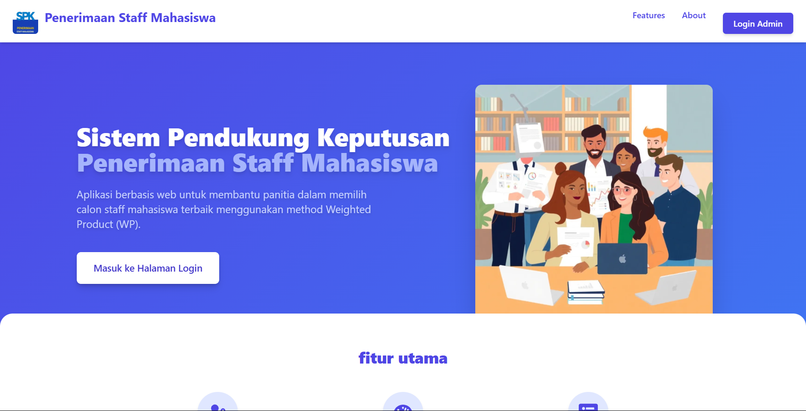

# SPK Penerimaan Staff Mahasiswa (Metode Weighted Product)

Aplikasi web Sistem Pendukung Keputusan (SPK) untuk membantu proses seleksi penerimaan staff mahasiswa secara objektif menggunakan metode Weighted Product (WP). Proyek ini dibuat sebagai tugas Ujian Akhir Semester (UAS) mata kuliah Sistem Pendukung Keputusan.




**Link Demo Live:** [spk-staff-app.netlify.app](https://ghulambelajar.netlify.app/)

---

## 🚀 Tentang Proyek

Aplikasi ini dirancang untuk mengatasi subjektivitas dalam proses seleksi manual. Dengan mendaftarkan calon, menentukan kriteria penilaian, dan memberikan bobot, panitia dapat memperoleh hasil perankingan kandidat yang paling direkomendasikan berdasarkan perhitungan matematis yang konsisten.

### Fitur Utama

* ✅ **Manajemen Kriteria:** Tambah, lihat, edit, dan hapus kriteria penilaian (CRUD).
* ✅ **Manajemen Calon:** Tambah, lihat, edit, dan hapus data calon mahasiswa (CRUD).
* ✅ **Proses Penilaian:** Antarmuka untuk menginput nilai setiap calon berdasarkan kriteria yang ada.
* ✅ **Perhitungan Weighted Product:** Logika perhitungan SPK untuk menghasilkan skor akhir.
* ✅ **Hasil Perankingan:** Menampilkan daftar calon yang sudah diurutkan berdasarkan skor tertinggi.
* 💾 **Penyimpanan Lokal:** Data tersimpan di Local Storage browser, sehingga tidak hilang saat halaman di-refresh.
* 🌐 **Siap Deploy:** Dilengkapi konfigurasi untuk deployment di platform seperti Netlify.

---

## 🛠️ Teknologi yang Digunakan

Proyek ini dibangun dengan teknologi modern di ekosistem JavaScript:

* **[React.js](https://reactjs.org/)**: Library JavaScript untuk membangun antarmuka pengguna.
* **[Vite](https://vitejs.dev/)**: Build tool modern yang memberikan pengalaman pengembangan super cepat.
* **[Tailwind CSS](https://tailwindcss.com/)**: Framework CSS utility-first untuk desain yang cepat dan responsif.
* **[React Router DOM](https://reactrouter.com/)**: Untuk menangani navigasi dan routing di dalam aplikasi.

---

## ⚙️ Panduan Instalasi dan Menjalankan

Untuk menjalankan proyek ini di komputermu, ikuti langkah-langkah berikut:

### Prasyarat

Pastikan kamu sudah menginstall:
* Node.js (versi 16 atau lebih baru)
* npm (biasanya sudah terinstall bersama Node.js)

### Instalasi

1.  **Clone repository ini:**
    ```bash
    git clone (https://github.com/ghulambelajar/SPK-STAFF-APP.git)
    ```

2.  **Masuk ke direktori proyek:**
    ```bash
    cd spk-staff-app
    ```

3.  **Install semua dependency yang dibutuhkan:**
    ```bash
    npm install
    ```

### Menjalankan Aplikasi

Setelah instalasi selesai, jalankan server pengembangan:
```bash
npm run dev